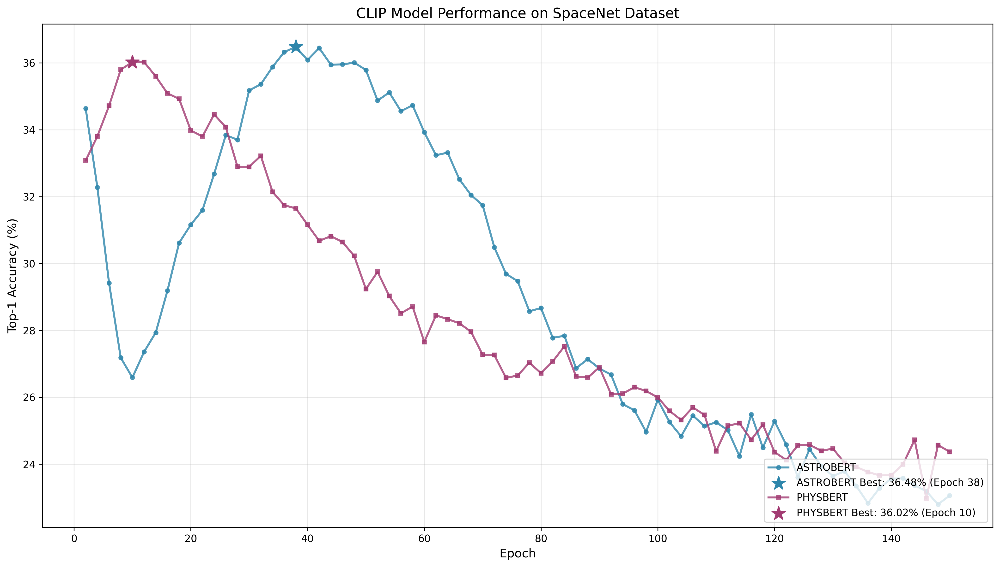

# CLIP SpaceNet Benchmark Report

**Generated:** 2025-12-30 10:18:43

## Dataset Statistics

- **Path:** /bigdisk/minhpvt/quick-test/na/ML/benchmark/data/spacenet/SpaceNet.FLARE.imam_alam
- **Total Samples:** 11448
- **Batch Size:** 1024

### Class Distribution

- asteroid: 283
- black hole: 656
- comet: 416
- constellation: 1552
- galaxy: 3984
- nebula: 1192
- planet: 1472
- star: 3269

## Model Performance Summary

### ASTROBERT

- **Best Accuracy:** 36.48% (Epoch 38)
- **Final Accuracy:** 23.06% (Epoch 150)
- **Mean Accuracy:** 29.01%
- **Std Accuracy:** 4.57%
- **Avg Time per Epoch:** 1.2s

### PHYSBERT

- **Best Accuracy:** 36.02% (Epoch 10)
- **Final Accuracy:** 24.37% (Epoch 150)
- **Mean Accuracy:** 28.34%
- **Std Accuracy:** 3.83%
- **Avg Time per Epoch:** 1.2s

## Performance Plot

## Execution Details

- **Total Evaluation Time:** 4728.5s (78.8 min)
- **GPU Devices:** [0, 1]
